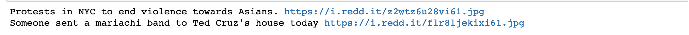

# Reddit2Twitter
This is a python client to use the Python Reddit API Wrapper and the Tweepy API in order to fetch the Title and Image of a Query to Reddit and upload it to Twitter.

## Installation
In order to use the app you will need:
- [Jupyter Notebook](https://jupyter.org/)
- An account with access to both [Reddit](https://github.com/reddit-archive/reddit/wiki/API) and [Twitter](https://developer.twitter.com/en/docs/twitter-api) APIs
- An instance of the [Python Reddit API Wrapper](https://praw.readthedocs.io/en/latest/getting_started/installation.html) using your own Reddit API
Once you have all the above you can clone the repo and open a notebook:
```
git clone https://github.com/ggcr/Reddit2Twitter.git ~/
jupyter notebook ~/Reddit2Twitter/Reddit2Twitter.ipynb
```
Then you will have to write your APIs credentials:
```
# TWITTER API CONF VALUES
CONSUMER_KEY=""
CONSUMER_SECRET=""
ACCESS_TOKEN=""
ACCESS_TOKEN_SECRET=""

# PRAW API CONF VALUES
REDDIT_API_INSTANCE=""

# PRAW API CONF VALUES
SUBREDDIT_NAME="europe"
LIMIT_POSTS=10
ORDER_BY="top"
TOP_TIME="week"

ADDITIONAL_TEXT="" # If you want to include additional text after the Reddit Post title to the tweet 
```

## Example
We want to upload the 2 top posts of Today from [r/pics](https://www.reddit.com/r/pics).

First we write our API credentials and query parameters:
```
# TWITTER API CONF VALUES
CONSUMER_KEY="***********************************"
CONSUMER_SECRET="***********************************"
ACCESS_TOKEN="***********************************"
ACCESS_TOKEN_SECRET="***********************************"

# PRAW API CONF VALUES
REDDIT_API_INSTANCE="**********"

# Reddit query
SUBREDDIT_NAME="pics"
LIMIT_POSTS=2
ORDER_BY="top"
TOP_TIME="day"

ADDITIONAL_TEXT="Hello Github! :)" # If you want to include additional text after the Reddit Post title to the tweet 
```


Then we execute the program giving us the following output:




Finally the program uploads the images to our Twitter account. Note the additional text displayed too ;)


